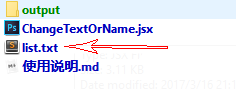
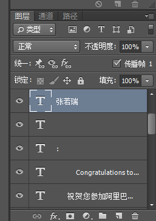
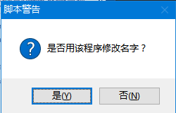
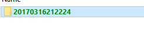
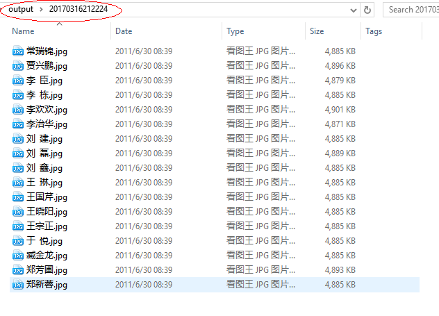

## 使用说明

本程序用于将 PS 中当前打开文件中的当前文本图层中的文本修改为执行文本文件中的文本。文本文件中的每一行文本将被替换一次，并保存为一个单独的文件。

本程序包含的文件如下：



使用方法如下：

1. 在本目录下的 **list.txt** 文本文件中输入要替换的文本，一行一个替换文本。如输入下面的内容：

   ```
   郑芳圃
   贾兴鹏
   李欢欢
   刘磊
   李臣
   李治华
   刘鑫
   郑新蓉
   常瑞锦
   李栋
   臧金龙
   刘建
   王晓阳
   王琳
   于悦
   王国芹
   王宗正
   ```

2. 打开你的 PS 模板文件，并在图层面板中选中你要替换文本的图层。

   例如 demo.psd 模板文件中的姓名图层。

   

3. 在脚本文件 **ChangeTextOrName.jsx** 处右键“**打开方式**”，选择 **Photoshop**。开始执行脚本。

4. 脚本首先会弹出一个对话框询问你是否在用本程序修改姓名，如果点“是”则会启动修改姓名的流程。

   

   修改姓名和修改普通文本的区别是：修改姓名的时候遇到两个字的名字（如王振），程序会自动把两个字的名字扩展成三个字，如“王振”扩展为“王  振”。

5. 等待脚本提示“**执行完成**”的时候，程序就执行完成了。

6. 修改好的图片文件会存放的 **output** 目录下的**以当前时间命名的子目录**下。

   

   输出的文件以修改文本为文件名：

   

## 注意事项

* 如果脚本在执行过程中提示错误，只要关闭 Photoshop 然后重新打开 Photoshop，重新执行脚本即可。


## 版权声明

本程序的版权归属为程序作者所有，未经授权不得使用、修改、传播。
